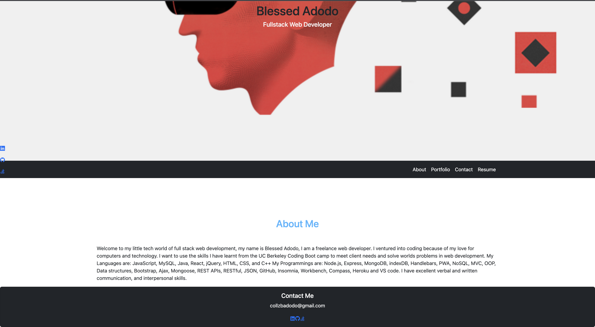
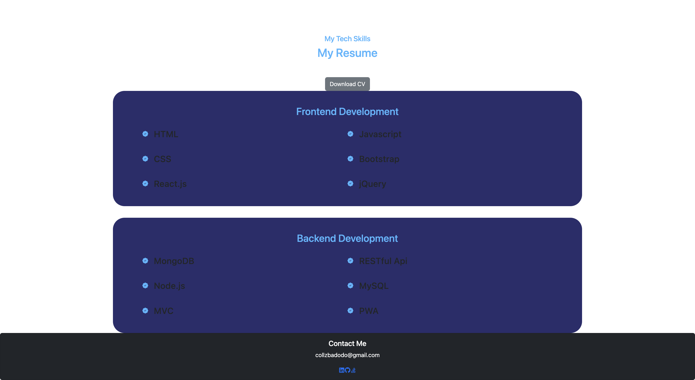

# My React Portfolio

### License

---

## Description

This is my web personal portfolio that i have created by using React.js.

---

## Table of Contents

1. [Installation](#installation)
2. [Usage](#usage)
3. [Test](#test)
4. [Questions](#questions)

---

## Installation Instructions

In the project directory, you can run:
npm start
Runs the app in the development mode.
Open http://localhost:3000 to view it in the browser.

The page will reload if you make edits.
You will also see any lint errors in the console.

## npm test
Launches the test runner in the interactive watch mode.

## npm run build
Builds the app for production to the build folder.

## npm run eject
Note: this is a one-way operation. Once you eject, you can’t go back!

If you aren’t satisfied with the build tool and configuration choices, you can eject at any time. This command will remove the single build dependency from your project.

Instead, it will copy all the configuration files and the transitive dependencies (webpack, Babel, ESLint, etc) right into your project so you have full control over them. All of the commands except eject will still work, but they will point to the copied scripts so you can tweak them. At this point you’re on your own.

You don’t have to ever use eject. The curated feature set is suitable for small and middle deployments, and you shouldn’t feel obligated to use this feature. However we understand that this tool wouldn’t be useful if you couldn’t customize it when you are ready for it.

## Usage Information

- Please open the link below and click. 
 [Deploy](https://collzbaba.github.io/react-portfolio-app/)

---

## Test ScreenShot

## Questions

### GitHub Profile:

https://github.com/collzbaba

### Contact Me:

If you have any additional questions, please send me an email.

#### collzbadodo@gmail.com

---
